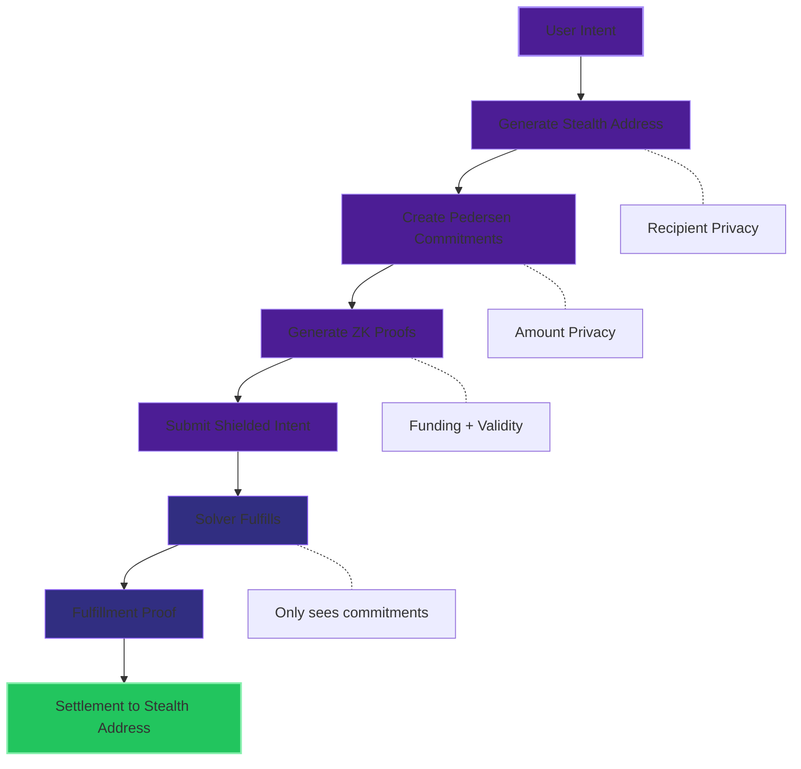
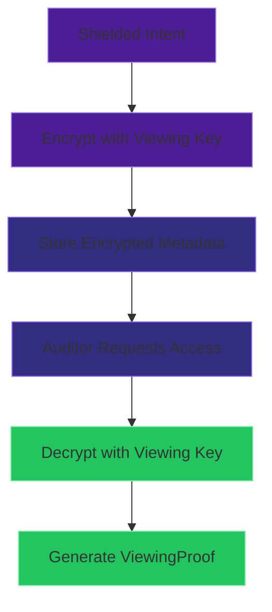

# Architecture

SIP Protocol operates as an application layer between user applications and the NEAR Intents settlement system.

## System Overview

```mermaid
flowchart TB
    subgraph APP["Application Layer"]
        direction LR
        DApps["DApps"]
        Wallets["Wallets"]
        DAOs["DAOs"]
    end

    subgraph SDK["@sip-protocol/sdk"]
        direction LR
        IB["Intent Builder"]
        SA["Stealth Address"]
        PM["Privacy Manager"]
        WA["Wallet Adapters"]
    end

    subgraph PRIVACY["Privacy Layer (SIP)"]
        direction TB
        subgraph Primitives["Cryptographic Primitives"]
            direction LR
            PC["Pedersen Commitments"]
            ST["Stealth Addresses"]
            VK["Viewing Keys"]
        end
        subgraph Proofs["ZK Proofs"]
            direction LR
            FP["Funding Proof"]
            VP["Validity Proof"]
            FFP["Fulfillment Proof"]
        end
    end

    subgraph SETTLE["Settlement Layer"]
        direction LR
        API["1Click API"]
        Solvers["Solvers"]
        CS["Chain Signatures"]
    end

    subgraph CHAINS["Blockchain Layer"]
        direction LR
        NEAR["NEAR"]
        ETH["Ethereum"]
        SOL["Solana"]
        ZEC["Zcash"]
        BTC["Bitcoin"]
    end

    APP --> SDK
    SDK --> PRIVACY
    PRIVACY --> SETTLE
    SETTLE --> CHAINS

    style APP fill:#1e1b4b,stroke:#8b5cf6,stroke-width:2px
    style SDK fill:#312e81,stroke:#8b5cf6,stroke-width:2px
    style PRIVACY fill:#4c1d95,stroke:#a78bfa,stroke-width:3px
    style SETTLE fill:#312e81,stroke:#8b5cf6,stroke-width:2px
    style CHAINS fill:#1e1b4b,stroke:#8b5cf6,stroke-width:2px
```



## SDK Components

### SIP Client

The main entry point that orchestrates all operations:

```typescript
const sip = new SIP({
  network: 'testnet',
  proofProvider: new MockProofProvider(),
})
```

### IntentBuilder

Fluent API for constructing shielded intents:

```typescript
const intent = await sip
  .intent()
  .input('solana', 'SOL', amount)
  .output('ethereum', 'ETH')
  .privacy(PrivacyLevel.SHIELDED)
  .build()
```

### Wallet Adapters

Chain-specific wallet integrations:

| Adapter | Chain | Provider |
|---------|-------|----------|
| `EthereumWalletAdapter` | Ethereum | MetaMask, WalletConnect |
| `SolanaWalletAdapter` | Solana | Phantom, Solflare |
| `MockWalletAdapter` | Testing | Mock provider |

### Proof Providers

ZK proof generation interfaces:

| Provider | Status | Use Case |
|----------|--------|----------|
| `MockProofProvider` | Available | Testing, development |
| `NoirProofProvider` | Planned | Production |

## Data Flow

### Transparent Flow


No privacy features. All data visible on-chain.

### Shielded Flow



### Compliant Flow

Same as shielded, plus:
- Encrypt transaction metadata with viewing key
- Auditor can decrypt specific transactions
- ViewingProof for audit reports



## Cryptographic Components

### Pedersen Commitments

```
C = value·G + blinding·H
```

- **Perfectly hiding**: Cannot extract value from C
- **Computationally binding**: Cannot change value after commit
- **Homomorphic**: C₁ + C₂ commits to sum of values

### Stealth Addresses

Based on EIP-5564:

1. Recipient publishes meta-address (P, Q)
2. Sender generates ephemeral key r
3. Sender computes stealth address A = Q + H(r·P)·G
4. Recipient scans for R values, derives private key

### Viewing Keys

Hierarchical key derivation:

```
Master Viewing Key
    ├── Full Viewing Key (all transactions)
    ├── Auditor Key (time-limited)
    └── Transaction Key (single transaction)
```

Encryption: XChaCha20-Poly1305 with HKDF key derivation.

## Network Adapters

### NEAR Intents Adapter

Connects to NEAR's 1Click API for cross-chain settlement:

```typescript
const adapter = new NEARIntentsAdapter({
  network: 'testnet',
  endpoint: 'https://1click.chaindefuser.com',
})
```

### Zcash Shielded Service

Handles Zcash-specific shielded transactions:

```typescript
const zcash = new ZcashShieldedService({
  rpcUrl: 'http://localhost:8232',
})
```

## Key Files

| File | Purpose |
|------|---------|
| `packages/sdk/src/sip.ts` | Main SIP client |
| `packages/sdk/src/intent.ts` | IntentBuilder |
| `packages/sdk/src/stealth.ts` | Stealth addresses |
| `packages/sdk/src/crypto.ts` | Pedersen commitments |
| `packages/sdk/src/privacy.ts` | Viewing keys |
| `packages/sdk/src/proofs/` | Proof providers |
| `packages/sdk/src/adapters/` | Network/wallet adapters |

## Performance

| Operation | Time (avg) |
|-----------|------------|
| Generate meta-address | 0.9ms |
| Derive stealth address | 5.4ms |
| Create commitment | 7.2ms |
| Verify commitment | 6.6ms |
| Full shielded intent | ~25ms |

Measured on Apple M1, Node.js 20.

## Tech Stack

- **Language**: TypeScript (strict)
- **Monorepo**: pnpm + Turborepo
- **Crypto**: @noble/curves, @noble/hashes, @noble/ciphers
- **Testing**: Vitest
- **CI/CD**: GitHub Actions
