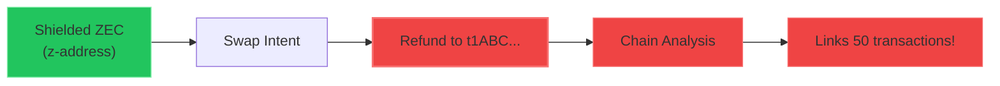
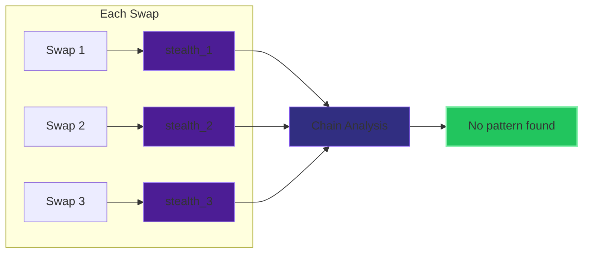
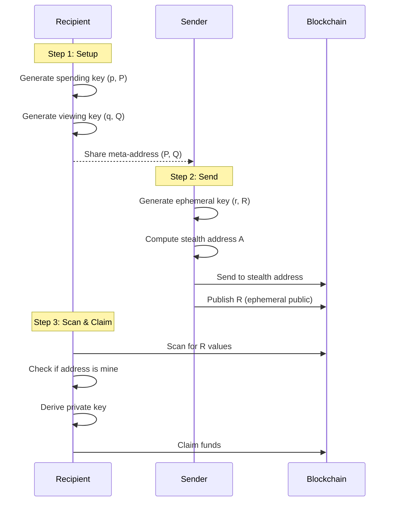

# Stealth Addresses

Stealth addresses provide **recipient privacy** by generating unique, one-time addresses for each transaction.

## The Problem

In current cross-chain swaps:



Reused addresses reveal transaction patterns.

## The Solution

With SIP stealth addresses:



Each transaction uses a unique, unlinkable address.

## How It Works

### Key Types

| Key | Symbol | Description |
|-----|--------|-------------|
| Spending private key | p | Controls spending |
| Spending public key | P = p·G | In meta-address |
| Viewing private key | q | Scans for incoming txs |
| Viewing public key | Q = q·G | In meta-address |
| Ephemeral key | r, R | Per-transaction |
| Stealth key | a, A | One-time address |

### Stealth Address Flow



### Step 1: Recipient Generates Meta-Address

```typescript
const { metaAddress, spendingPrivateKey, viewingPrivateKey } =
  generateStealthMetaAddress('ethereum')

// Share meta-address publicly
console.log(metaAddress)
// sip:ethereum:0x02abc...def:0x03xyz...789
```

### Step 2: Sender Generates Stealth Address

```typescript
const { stealthAddress, ephemeralPublicKey } =
  generateStealthAddress(recipientMetaAddress)

// Send funds to stealthAddress.address
// Publish ephemeralPublicKey alongside transaction
```

### Step 3: Recipient Scans and Claims

```typescript
// Recipient scans for their transactions
const isMine = checkStealthAddress(
  stealthAddress,
  spendingPrivateKey,
  viewingPrivateKey
)

if (isMine) {
  // Derive private key to claim funds
  const privateKey = deriveStealthPrivateKey(
    stealthAddress,
    ephemeralPublicKey,
    spendingPrivateKey,
    viewingPrivateKey
  )
}
```

## Cryptographic Protocol

### Key Generation

```
KeyGen():
  1. p ← random_scalar()     // Spending private
  2. P ← p · G               // Spending public
  3. q ← random_scalar()     // Viewing private
  4. Q ← q · G               // Viewing public
  Return: ((P, Q), p, q)
```

### Stealth Address Generation

```
GenerateStealth(P, Q):
  1. r ← random_scalar()     // Ephemeral private
  2. R ← r · G               // Ephemeral public
  3. S ← r · P               // Shared secret (ECDH)
  4. h ← SHA256(S)           // Hash shared secret
  5. view_tag ← h[0]         // First byte (optimization)
  6. A ← Q + h · G           // Stealth address
  Return: (A, R, view_tag)
```

### Scanning

```
ScanForStealth(R, A, view_tag, p, q):
  1. S' ← p · R              // Recompute shared secret
  2. h' ← SHA256(S')

  // Quick reject using view tag
  3. if h'[0] ≠ view_tag: return NOT_MINE

  // Full verification
  4. A' ← Q + h' · G
  5. if A' ≠ A: return NOT_MINE
  Return: MINE
```

### Private Key Recovery

```
DerivePrivateKey(R, p, q):
  1. S ← p · R
  2. h ← SHA256(S)
  3. a ← q + h (mod n)       // Stealth private key
  Return: a
```

## Encoding Format

### Meta-Address

```
sip:<chain>:<spending_key>:<viewing_key>

Example:
sip:ethereum:0x02abc...def:0x03123...456
```

### Supported Chains

| Chain ID | Description |
|----------|-------------|
| `ethereum` | Ethereum mainnet |
| `solana` | Solana mainnet |
| `zcash` | Zcash (t-addresses) |
| `near` | NEAR Protocol |
| `polygon` | Polygon PoS |

## Security Properties

| Property | Guarantee |
|----------|-----------|
| **Unlinkability** | Different addresses cannot be linked |
| **Recipient Privacy** | Observer cannot determine recipient |
| **Sender Deniability** | Anyone could have generated the address |
| **Forward Secrecy** | Viewing key compromise doesn't reveal past |

### What is Protected

| Information | Protected? |
|-------------|------------|
| Recipient identity | Yes |
| Link between txs | Yes |
| Recipient's balance | Yes |
| Viewing key holder | Yes |

### What is NOT Protected

| Information | Protected? | Notes |
|-------------|------------|-------|
| Transaction amount | No | Use commitments |
| Sender identity | No | Stealth is for recipient |
| Transaction timing | No | Block timestamp visible |

## View Tag Optimization

The 8-bit view tag reduces scanning work by 256x:

- Only 1/256 addresses need full verification
- Leaks 8 bits of information (acceptable tradeoff)
- Addresses sharing view tag are still unlinkable

## Chain-Specific Derivation

Different chains derive addresses differently from stealth public key A:

| Chain | Derivation |
|-------|------------|
| Ethereum | `keccak256(A)[12:32]` |
| Zcash (t-addr) | `hash160(A)` + version |
| Bitcoin | `hash160(A)` + version |

## Code Example

```typescript
import {
  generateStealthMetaAddress,
  generateStealthAddress,
  checkStealthAddress,
  deriveStealthPrivateKey,
  encodeStealthMetaAddress,
  decodeStealthMetaAddress
} from '@sip-protocol/sdk'

// Recipient setup (one-time)
const meta = generateStealthMetaAddress('ethereum')
const encoded = encodeStealthMetaAddress(meta.metaAddress)
// Share `encoded` publicly

// Sender creates payment
const decoded = decodeStealthMetaAddress(encoded)
const { stealthAddress, ephemeralPublicKey } =
  generateStealthAddress(decoded)

// Recipient scans
const isMine = checkStealthAddress(
  stealthAddress,
  meta.spendingPrivateKey,
  meta.viewingPrivateKey
)

// Recipient claims
if (isMine) {
  const pk = deriveStealthPrivateKey(
    stealthAddress,
    ephemeralPublicKey,
    meta.spendingPrivateKey,
    meta.viewingPrivateKey
  )
  // Use pk to spend from stealthAddress
}
```

## Supported Curves

SIP supports multiple elliptic curves to enable stealth addresses across different blockchain ecosystems:

| Curve | Chains | Notes |
|-------|--------|-------|
| **secp256k1** | Ethereum, Bitcoin, Zcash | Default for EVM chains |
| **ed25519** | Solana, NEAR | Required for Solana/NEAR address derivation |

### Curve Selection

```typescript
// secp256k1 (default) - for Ethereum, Bitcoin, Zcash
const ethMeta = generateStealthMetaAddress('ethereum')
const btcMeta = generateStealthMetaAddress('bitcoin')

// ed25519 - for Solana, NEAR
const solMeta = generateStealthMetaAddress('solana', { curve: 'ed25519' })
const nearMeta = generateStealthMetaAddress('near', { curve: 'ed25519' })
```

### Curve Differences

| Aspect | secp256k1 | ed25519 |
|--------|-----------|---------|
| Key size | 32 bytes | 32 bytes |
| Signature | ECDSA | EdDSA |
| Speed | Fast | Faster |
| EVM compatible | Yes | No |
| Solana compatible | No | Yes |

### Chain-Specific Address Derivation

| Chain | Curve | Derivation |
|-------|-------|------------|
| Ethereum | secp256k1 | `keccak256(pubkey)[12:32]` |
| Bitcoin | secp256k1 | `hash160(pubkey)` + version |
| Zcash (t-addr) | secp256k1 | `hash160(pubkey)` + version |
| Solana | ed25519 | Raw 32-byte pubkey (base58) |
| NEAR | ed25519 | `ed25519:` + base58 pubkey |

## EIP-5564 Compatibility

SIP stealth addresses align with EIP-5564:

| Aspect | EIP-5564 | SIP |
|--------|----------|-----|
| Curve | secp256k1 | secp256k1 + ed25519 |
| Key structure | (P, Q) | (P, Q) |
| Shared secret | ECDH | ECDH / X25519 |
| View tag | 1 byte | 1 byte |

**Extensions**: SIP adds multi-chain support via `sip:` URI scheme and ed25519 for non-EVM chains.
