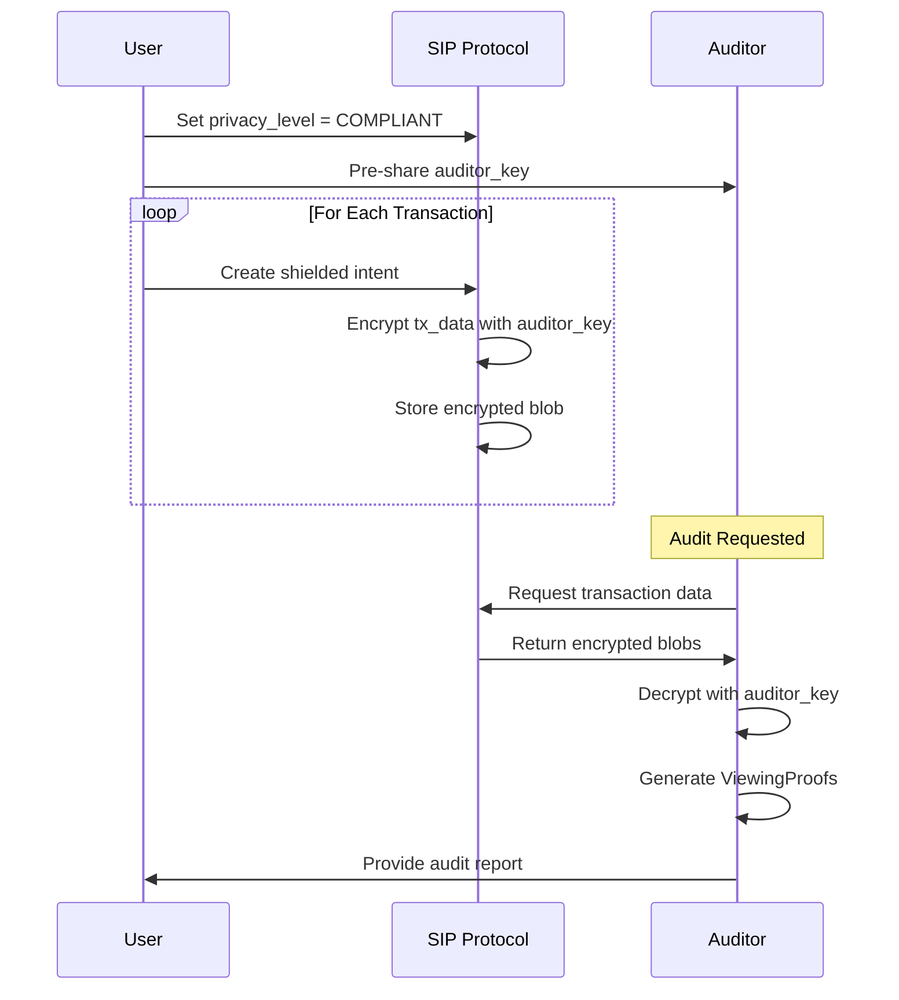
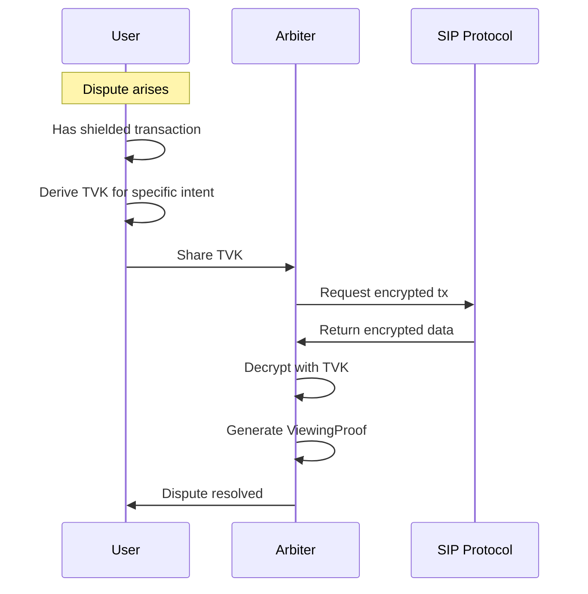

# Viewing Keys

Viewing keys enable **selective disclosure** of shielded transaction details to authorized parties without compromising overall privacy.

## Use Cases

| Use Case | Description |
|----------|-------------|
| Tax Compliance | Share transaction history with tax authority |
| Audit | Allow auditor to verify specific transactions |
| Institutional | Meet regulatory requirements |
| Dispute Resolution | Prove transaction occurred to third party |
| Inheritance | Grant read access to estate executor |

## Privacy Model

```mermaid
flowchart LR
    subgraph Full["Full Privacy (Shielded)"]
        U1["User"] --> T1["Transactions"]
    end

    subgraph Selective["Selective Disclosure"]
        U2["User"] --> T2["Transactions"]
        V2["Authorized Viewer"] --> T2
    end

    subgraph Compliant["Compliant Mode"]
        U3["User"] --> T3["All Transactions"]
        A3["Auditor"] --> T3
    end

    style Full fill:#4c1d95,stroke:#a78bfa,stroke-width:2px
    style Selective fill:#312e81,stroke:#8b5cf6
    style Compliant fill:#1e1b4b,stroke:#8b5cf6
```



## Key Hierarchy

```mermaid
flowchart TB
    SEED["User Seed"] --> MVK["Master Viewing Key (MVK)"]

    MVK --> FVK["Full Viewing Key (FVK)"]
    MVK --> AK["Auditor Key (AK)"]
    MVK --> TVK["Transaction Viewing Keys (TVK)"]

    FVK --> FVK_DESC["Sees ALL transactions"]
    AK --> AK_DESC["Sees ALL txs, time-limited"]
    TVK --> TVK_DESC["Sees SINGLE transaction"]

    style SEED fill:#1e1b4b,stroke:#8b5cf6
    style MVK fill:#4c1d95,stroke:#a78bfa,stroke-width:2px
    style FVK fill:#ef4444,stroke:#f87171
    style AK fill:#f59e0b,stroke:#fbbf24
    style TVK fill:#22c55e,stroke:#86efac

    style FVK_DESC fill:none,stroke:none
    style AK_DESC fill:none,stroke:none
    style TVK_DESC fill:none,stroke:none
```



### Master Viewing Key (MVK)

Root key derived from user's wallet seed:

```typescript
const mvk = generateViewingKey('/m/44/501/0')
```

### Full Viewing Key (FVK)

Grants access to ALL transactions:

```typescript
const fvk = deriveViewingKey(mvk, '/full')
```

**Warning**: FVK exposure reveals entire transaction history.

### Auditor Key (AK)

Time-limited viewing key for compliance:

```typescript
const auditKey = deriveViewingKey(mvk, '/audit/2024')
```

### Transaction Viewing Key (TVK)

Per-transaction key for selective disclosure:

```typescript
const tvk = deriveViewingKey(mvk, `/tx/${intentHash}`)
```

Reveals ONLY the specific transaction.

## Encryption Scheme

### Algorithm

| Component | Algorithm |
|-----------|-----------|
| Key derivation | HKDF-SHA256 |
| Symmetric encryption | XChaCha20-Poly1305 |
| Nonce | 24 bytes random |

### Encrypting Transaction Data

```typescript
import { encryptForViewing, decryptWithViewing } from '@sip-protocol/sdk'

const txData = {
  sender: '0xabc...',
  recipient: '0xdef...',
  amount: 1000n,
  asset: 'ETH'
}

// Encrypt for viewing key holder
const encrypted = encryptForViewing(txData, viewingKey)

// Decrypt with key
const decrypted = decryptWithViewing(encrypted, viewingKey)
```

### Multi-Key Encryption

Encrypt for multiple authorized viewers:

```typescript
const encrypted = encryptForViewing(txData, [
  auditorKey,
  complianceKey,
  taxKey
])
```

Each key holder can decrypt independently.

## Viewing Proof

A ViewingProof demonstrates that decrypted data is authentic without revealing the viewing key.

```typescript
interface ViewingProof {
  intentHash: string
  revealedData: TransactionData
  commitmentProof: {
    inputAmountProof: ZKProof
    outputAmountProof: ZKProof
  }
  viewingKeyHash: string
  proofTimestamp: number
}
```

Verifier checks:
1. ZK proof is valid
2. Revealed amounts match on-chain commitments
3. Viewing key hash matches authorized viewer

## Access Control

### Key Registration

```typescript
interface ViewingKeyGrant {
  grantId: string
  recipientId: string
  keyType: 'full' | 'auditor' | 'transaction'
  scope: {
    startTime?: number
    endTime?: number
    intentHashes?: string[]
  }
  createdAt: number
  revokedAt?: number
}
```

### Revocation

Keys can be revoked but previously-viewed data cannot be "un-revealed":

```typescript
await revokeViewingKey(grantId)
```

**Important**: Revocation prevents future access. Past disclosures are permanent.

## Security Properties

| Property | Guarantee |
|----------|-----------|
| Confidentiality | Only key holders can decrypt |
| Integrity | AEAD prevents tampering |
| Authenticity | ViewingProof proves data is real |
| Selective Disclosure | TVK reveals only one transaction |
| Forward Secrecy | Key compromise doesn't reveal past txs (with TVK) |

### What Viewing Keys CAN Do

- Decrypt transaction details
- Prove transaction authenticity
- Verify amounts match commitments

### What Viewing Keys CANNOT Do

- Spend funds
- Create new transactions
- Modify transaction history
- Reveal other users' transactions

## Integration with Privacy Levels

| Level | Viewing Key Behavior |
|-------|---------------------|
| TRANSPARENT | No encryption, public |
| SHIELDED | Encrypted, no viewing key shared |
| COMPLIANT | Encrypted, auditor key pre-shared |

## Workflow: Compliant Mode



## Workflow: Selective Disclosure



## Code Example

```typescript
import {
  generateViewingKey,
  deriveViewingKey,
  encryptForViewing,
  decryptWithViewing
} from '@sip-protocol/sdk'

// Generate master key from path
const masterKey = generateViewingKey('/m/44/501/0')

// Derive purpose-specific keys
const auditKey = deriveViewingKey(masterKey, '/audit/2024')
const taxKey = deriveViewingKey(masterKey, '/tax/quarterly')

// Encrypt transaction for auditor
const txData = {
  intentHash: '0x123...',
  inputAmount: 1000n,
  outputAmount: 950n,
  sender: '0xabc...',
  recipient: '0xdef...'
}

const encrypted = encryptForViewing(txData, auditKey)

// Auditor decrypts
const revealed = decryptWithViewing(encrypted, auditKey)
console.log(revealed.inputAmount) // 1000n
```

## Trust Model

| Key Type | Trust Required | Risk |
|----------|---------------|------|
| **FVK** | High | Full history exposure |
| **AK** | Medium | Bounded by time |
| **TVK** | Low | Single transaction |

## Comparison with Zcash

| Feature | Zcash | SIP |
|---------|-------|-----|
| Viewing key concept | Yes | Yes |
| Time-limited keys | No | Yes |
| ViewingProof | No | Yes |
| Multi-key encryption | No | Yes |
| Intent integration | No | Yes |
