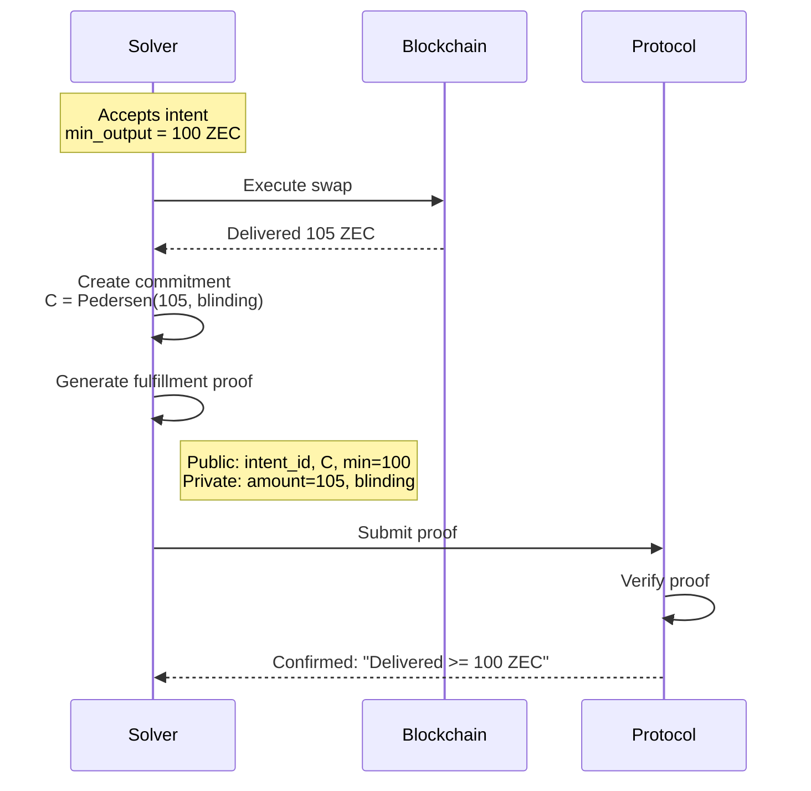
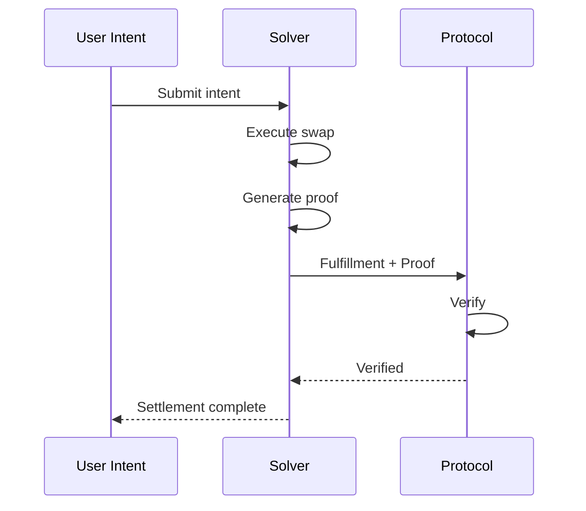

import { Badge, Card } from '@astrojs/starlight/components'

<div style="display: flex; gap: 0.5rem; margin-bottom: 1rem;">
  <Badge text="Planned" variant="caution" />
  <Badge text="Noir" variant="note" />
  <Badge text="~80 constraints" variant="tip" />
</div>

<Card title="TL;DR">
Proves a solver correctly executed a swap **without revealing the exact amount or transaction path**. Verifies delivery to the correct stealth address and that output meets minimum requirements.
</Card>

# Fulfillment Proof Specification

The Fulfillment Proof demonstrates that a solver correctly executed a swap without revealing transaction details.

## Purpose

After fulfilling an intent, the solver must prove:

**"I delivered at least X tokens to the correct recipient"** without revealing **"exact amount or transaction path"**

## Public vs Private Inputs

| Input | Visibility | Description |
|-------|------------|-------------|
| `intent_id` | Public | Intent being fulfilled |
| `output_commitment` | Public | Commitment to output amount |
| `min_output` | Public | Minimum required output |
| `recipient_stealth` | Public | Stealth address for delivery |
| `output_amount` | Private | Actual delivered amount |
| `output_blinding` | Private | Commitment randomness |
| `tx_proof` | Private | Proof of on-chain execution |

## Circuit Specification

### Constraints

1. **Minimum Met**: `output_amount >= min_output`
2. **Commitment Valid**: `Pedersen(output_amount, blinding) = output_commitment`
3. **Delivery Verified**: Transaction sent to `recipient_stealth`

### Noir Implementation

```noir
use dep::std::hash::pedersen_hash;

fn main(
    // Public inputs
    intent_id: pub Field,
    output_commitment: pub Field,
    min_output: pub u64,
    recipient_stealth: pub Field,

    // Private inputs
    output_amount: u64,
    output_blinding: Field,
    tx_hash: Field,
    tx_recipient: Field,
) {
    // Constraint 1: Minimum output met
    assert(output_amount >= min_output);

    // Constraint 2: Commitment correctness
    let computed = pedersen_hash([
        output_amount as Field,
        output_blinding
    ]);
    assert(computed == output_commitment);

    // Constraint 3: Correct recipient
    assert(tx_recipient == recipient_stealth);

    // Binding: tx_hash commits to execution
    // (verified on-chain separately)
}
```

## Workflow



## Security Properties

| Property | Guarantee |
|----------|-----------|
| **Soundness** | Cannot claim false fulfillment |
| **Zero-knowledge** | Exact amount hidden |
| **Binding** | Cannot change claimed delivery |

## Solver Workflow



## Integration with SDK

```typescript
import { MockProofProvider, FulfillmentProofParams } from '@sip-protocol/sdk'

const proofProvider = new MockProofProvider()

const params: FulfillmentProofParams = {
  intentId: '0x...',
  outputCommitment: '0x...',
  minOutput: 100n,
  recipientStealth: '0x...',
  outputAmount: 105n,
  outputBlinding: '0x...',
  txHash: '0x...'
}

const result = await proofProvider.generateFulfillmentProof(params)
```

## Proof Format

```typescript
interface FulfillmentProof {
  proof: HexString
  publicInputs: {
    intentId: Field
    outputCommitment: Field
    minOutput: u64
    recipientStealth: Field
  }
  framework: 'noir' | 'mock'
  timestamp: number
}
```

## Oracle Attestation

For cross-chain verification, an oracle may attest to delivery:

```typescript
interface OracleAttestation {
  intentId: string
  chainId: string
  txHash: string
  recipient: string
  amount: bigint
  timestamp: number
  oracleSignature: string
}
```

## Edge Cases

| Case | Handling |
|------|----------|
| Partial fill | Multiple proofs for partial |
| Overpayment | Valid (exceeds minimum) |
| Wrong recipient | Proof verification fails |
| Failed tx | No proof generated |

## Performance

| Metric | Mock | Noir (estimated) |
|--------|------|------------------|
| Proof generation | <1ms | 2-4s |
| Proof size | 64 bytes | ~200 bytes |
| Verification | <1ms | ~10ms |
