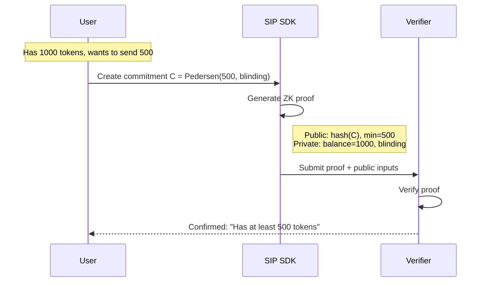

import { Badge, Card } from '@astrojs/starlight/components'

<div style="display: flex; gap: 0.5rem; margin-bottom: 1rem;">
  <Badge text="Planned" variant="caution" />
  <Badge text="Noir" variant="note" />
  <Badge text="~50 constraints" variant="tip" />
</div>

<Card title="TL;DR">
Proves user has sufficient balance to cover a transaction **without revealing the actual balance**. Uses Pedersen commitments to hide amounts while proving `balance >= minimum`.
</Card>

# Funding Proof Specification

The Funding Proof demonstrates that a user has sufficient balance to cover a transaction without revealing the actual balance.

## Purpose

When creating a shielded intent, the user commits to an input amount but doesn't reveal it. The Funding Proof proves:

**"I have at least X tokens"** without revealing **"I have exactly Y tokens"**

## Public vs Private Inputs

| Input | Visibility | Description |
|-------|------------|-------------|
| `commitment_hash` | Public | Hash of the amount commitment |
| `minimum_amount` | Public | Required minimum balance |
| `actual_balance` | Private | User's true balance |
| `blinding_factor` | Private | Commitment randomness |

## Circuit Specification

### Constraints

1. **Balance Sufficiency**: `actual_balance >= minimum_amount`
2. **Commitment Correctness**: `Pedersen(actual_balance, blinding) = commitment`

### Noir Implementation

```noir
use dep::std::hash::pedersen_hash;

fn main(
    // Public inputs
    commitment_hash: pub Field,
    minimum_amount: pub u64,

    // Private inputs (witness)
    actual_balance: u64,
    blinding_factor: Field,
) {
    // Constraint 1: Sufficient balance
    assert(actual_balance >= minimum_amount);

    // Constraint 2: Commitment validity
    let computed_commitment = pedersen_hash([
        actual_balance as Field,
        blinding_factor
    ]);

    assert(computed_commitment == commitment_hash);
}
```

## Workflow



## Security Properties

| Property | Guarantee |
|----------|-----------|
| **Soundness** | Cannot prove false balance |
| **Zero-knowledge** | Actual balance not revealed |
| **Binding** | Cannot change committed amount |

## Integration with SDK

```typescript
import { MockProofProvider, FundingProofParams } from '@sip-protocol/sdk'

const proofProvider = new MockProofProvider()

const params: FundingProofParams = {
  commitmentHash: '0x...',
  minimumAmount: 500n,
  actualBalance: 1000n,
  blindingFactor: '0x...'
}

const result = await proofProvider.generateFundingProof(params)

if (result.valid) {
  console.log('Proof:', result.proof)
}
```

## Proof Format

```typescript
interface FundingProof {
  proof: HexString       // ZK proof bytes
  publicInputs: {
    commitmentHash: Field
    minimumAmount: u64
  }
  framework: 'noir' | 'mock'
  timestamp: number
}
```

## Verification

Solvers verify the funding proof before accepting an intent:

```typescript
const isValid = await proofProvider.verifyProof(
  fundingProof,
  [commitmentHash, minimumAmount]
)

if (!isValid) {
  throw new Error('Invalid funding proof')
}
```

## Edge Cases

| Case | Handling |
|------|----------|
| Balance = Minimum | Valid (equality allowed) |
| Balance < Minimum | Proof generation fails |
| Zero balance | Proof fails unless min=0 |
| Overflow | Constrained by field size |

## Performance

| Metric | Mock | Noir (estimated) |
|--------|------|------------------|
| Proof generation | <1ms | 2-3s |
| Proof size | 64 bytes | ~200 bytes |
| Verification | <1ms | ~10ms |
