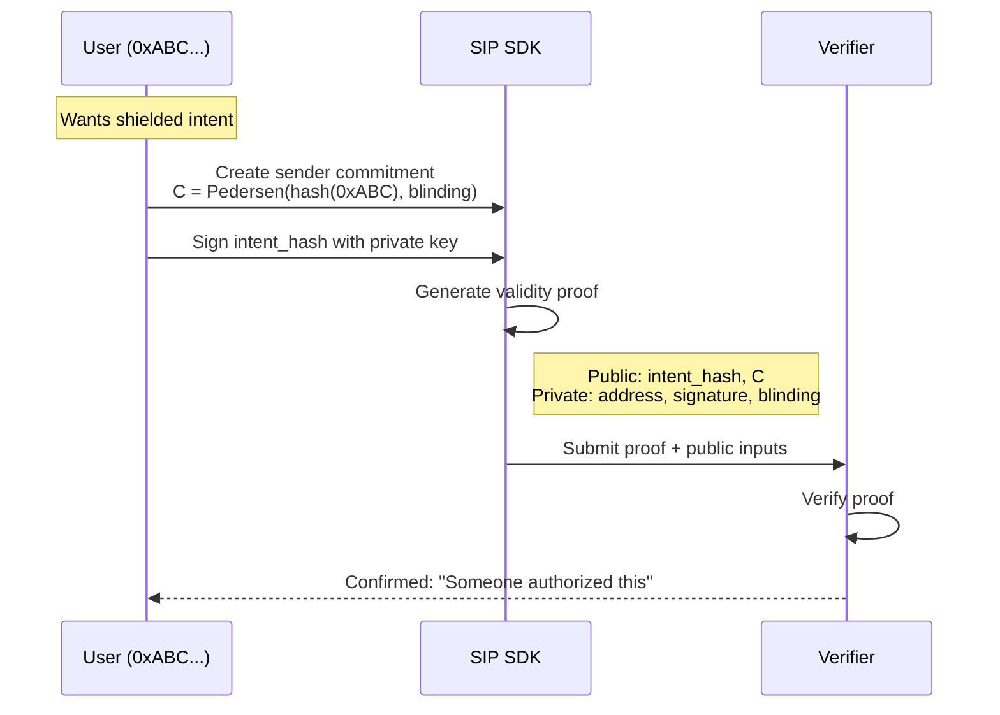
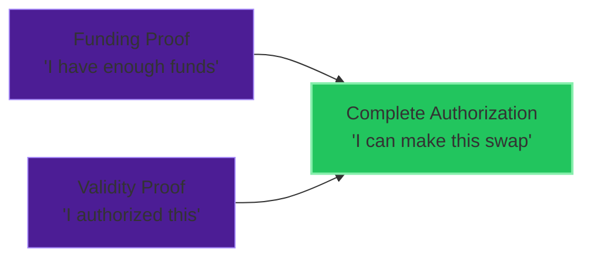

import { Badge, Card } from '@astrojs/starlight/components'

<div style="display: flex; gap: 0.5rem; margin-bottom: 1rem;">
  <Badge text="Planned" variant="caution" />
  <Badge text="Noir" variant="note" />
  <Badge text="~150 constraints" variant="tip" />
</div>

<Card title="TL;DR">
Proves an intent was authorized by a legitimate sender **without revealing their identity**. Uses ECDSA signature verification inside the circuit to prove "someone with spending authority signed this."
</Card>

# Validity Proof Specification

The Validity Proof demonstrates that an intent was authorized by a legitimate sender without revealing their identity.

## Purpose

In shielded mode, the sender is hidden behind a commitment. The Validity Proof proves:

**"This intent was authorized by someone with spending authority"** without revealing **"who specifically authorized it"**

## Public vs Private Inputs

| Input | Visibility | Description |
|-------|------------|-------------|
| `intent_hash` | Public | Hash of the intent being authorized |
| `sender_commitment` | Public | Commitment to sender identity |
| `sender_address` | Private | Actual sender address |
| `signature` | Private | Sender's signature on intent |
| `blinding_factor` | Private | Commitment randomness |

## Circuit Specification

### Constraints

1. **Signature Valid**: Signature verifies against sender_address
2. **Commitment Binding**: `Pedersen(hash(sender_address), blinding) = sender_commitment`
3. **Intent Binding**: Signature is over the correct intent_hash

### Noir Implementation

```noir
use dep::std::ecdsa::verify_signature;
use dep::std::hash::{pedersen_hash, poseidon::hash_1};

fn main(
    // Public inputs
    intent_hash: pub Field,
    sender_commitment: pub Field,

    // Private inputs
    sender_address: Field,
    signature_r: [u8; 32],
    signature_s: [u8; 32],
    public_key_x: [u8; 32],
    public_key_y: [u8; 32],
    blinding_factor: Field,
) {
    // Constraint 1: Verify ECDSA signature
    let message = intent_hash.to_be_bytes(32);
    let valid_sig = verify_signature(
        public_key_x,
        public_key_y,
        signature_r,
        signature_s,
        message
    );
    assert(valid_sig);

    // Constraint 2: Sender address matches public key
    let derived_address = hash_1([
        bytes_to_field(public_key_x),
        bytes_to_field(public_key_y)
    ]);
    assert(derived_address == sender_address);

    // Constraint 3: Commitment correctness
    let address_hash = hash_1([sender_address]);
    let computed_commitment = pedersen_hash([
        address_hash,
        blinding_factor
    ]);
    assert(computed_commitment == sender_commitment);
}
```

## Workflow



## Security Properties

| Property | Guarantee |
|----------|-----------|
| **Soundness** | Only key holder can prove |
| **Zero-knowledge** | Sender address hidden |
| **Non-transferability** | Proof tied to specific intent |

## Relationship to Other Proofs



## Integration with SDK

```typescript
import { MockProofProvider, ValidityProofParams } from '@sip-protocol/sdk'

const proofProvider = new MockProofProvider()

const params: ValidityProofParams = {
  intentHash: '0x...',
  senderCommitment: '0x...',
  senderAddress: '0xABC...',
  signature: '0x...',
  blindingFactor: '0x...'
}

const result = await proofProvider.generateValidityProof(params)
```

## Proof Format

```typescript
interface ValidityProof {
  proof: HexString
  publicInputs: {
    intentHash: Field
    senderCommitment: Field
  }
  framework: 'noir' | 'mock'
  timestamp: number
}
```

## Edge Cases

| Case | Handling |
|------|----------|
| Invalid signature | Proof generation fails |
| Wrong intent hash | Proof won't verify |
| Replay attempt | Intent hash includes nonce |
| Multi-sig | Extended circuit needed |

## Performance

| Metric | Mock | Noir (estimated) |
|--------|------|------------------|
| Proof generation | <1ms | 3-5s |
| Proof size | 64 bytes | ~250 bytes |
| Verification | <1ms | ~15ms |
