# ZK Proof Architecture

SIP uses **Noir** as the primary ZK circuit language for zero-knowledge proofs.

## Overview

SIP requires ZK proofs for three core operations:

1. **Funding Proof** - Prove sufficient funds without revealing balance
2. **Validity Proof** - Prove intent authorization without revealing sender
3. **Fulfillment Proof** - Prove correct execution without revealing path

## Framework Selection

### Decision: Noir

Noir provides the best balance of:
- Developer experience (Rust-like syntax)
- Backend flexibility (UltraPlonk, Groth16, Halo2)
- Universal setup (no per-circuit trusted setup)
- Rich standard library

### Evaluation Matrix

| Criteria | Circom | Noir | Halo2 |
|----------|--------|------|-------|
| Security | 9/10 | 7/10 | 7/10 |
| DX | 5/10 | 9/10 | 4/10 |
| Performance | 9/10 | 7/10 | 8/10 |
| Trust Assumptions | 5/10 | 8/10 | 10/10 |
| **Weighted Score** | 7.05 | **7.75** | 6.55 |

## Circuit Specifications

### Funding Proof

Proves user has sufficient balance without revealing actual amount.

```noir
fn funding_proof(
    // Public inputs
    commitment_hash: pub Field,
    minimum_amount: pub u64,

    // Private inputs
    actual_balance: u64,
    blinding_factor: Field,
) {
    // Prove balance is sufficient
    assert(actual_balance >= minimum_amount);

    // Prove commitment is correctly formed
    let computed = pedersen_commit(
        actual_balance as Field,
        blinding_factor
    );
    assert(commitment_hash(computed) == commitment_hash);
}
```

### Validity Proof

Proves intent is authorized without revealing sender.

```noir
fn validity_proof(
    // Public inputs
    intent_hash: pub Field,
    sender_commitment: pub Field,

    // Private inputs
    sender_address: Field,
    signature: [u8; 64],
    blinding: Field,
) {
    // Verify signature
    let is_valid = ecdsa_verify(
        sender_address,
        intent_hash,
        signature
    );
    assert(is_valid);

    // Verify sender commitment
    let address_hash = poseidon::hash_1([sender_address]);
    let computed = pedersen_commit(address_hash, blinding);
    assert(commitment_hash(computed) == sender_commitment);
}
```

### Fulfillment Proof

Proves solver correctly executed the swap.

```noir
fn fulfillment_proof(
    // Public inputs
    intent_id: pub Field,
    output_commitment: pub Field,
    min_output: pub u64,
    recipient_stealth: pub Field,

    // Private inputs
    output_amount: u64,
    output_blinding: Field,
    tx_hash: Field,
) {
    // Prove output meets minimum
    assert(output_amount >= min_output);

    // Prove commitment correctness
    let computed = pedersen_commit(
        output_amount as Field,
        output_blinding
    );
    assert(commitment_hash(computed) == output_commitment);

    // Prove delivery to stealth address
    // (binding to tx_hash proves execution)
}
```

## Standard Library

Noir provides built-in support for:

| Primitive | Usage |
|-----------|-------|
| Pedersen hash | Commitment scheme |
| SHA256 | Compatibility |
| Poseidon | Field-efficient hashing |
| ECDSA | Wallet signatures |
| EdDSA | Alternative signatures |
| Schnorr | Stealth derivation |

## Architecture

```mermaid
flowchart TB
    subgraph SDK["SDK (TypeScript)"]
        subgraph PP["ProofProvider Interface"]
            Mock["MockProvider"]
            Noir["NoirProvider"]
        end
    end

    SDK --> TestPath
    SDK --> ProdPath

    subgraph TestPath["Testing Path"]
        MockProofs["Mock Proofs<br/>(Testing)"]
    end

    subgraph ProdPath["Production Path"]
        NoirJS["Noir / NoirJS<br/>(Production)"]
    end

    NoirJS --> UP["UltraPlonk Backend"]
    NoirJS --> G16["Groth16 Backend"]

    style SDK fill:#312e81,stroke:#8b5cf6,stroke-width:2px
    style PP fill:#4c1d95,stroke:#a78bfa
    style TestPath fill:#1e1b4b,stroke:#8b5cf6
    style ProdPath fill:#4c1d95,stroke:#a78bfa,stroke-width:2px
    style UP fill:#22c55e,stroke:#86efac
    style G16 fill:#22c55e,stroke:#86efac
```



## SDK Integration

### ProofProvider Interface

```typescript
interface ProofProvider {
  generateFundingProof(params: FundingProofParams): Promise<ProofResult>
  generateValidityProof(params: ValidityProofParams): Promise<ProofResult>
  generateFulfillmentProof(params: FulfillmentProofParams): Promise<ProofResult>
  verifyProof(proof: ZKProof, publicInputs: Field[]): Promise<boolean>
}
```

### MockProofProvider

For testing and development:

```typescript
const sip = new SIP({
  network: 'testnet',
  proofProvider: new MockProofProvider()
})
```

### NoirProofProvider (Planned)

For production:

```typescript
const sip = new SIP({
  network: 'mainnet',
  proofProvider: new NoirProofProvider({
    wasmPath: '/circuits/funding.wasm',
    circuitPath: '/circuits/'
  })
})
```

## Performance

| Operation | Mock | Noir (estimated) |
|-----------|------|------------------|
| Funding proof gen | <1ms | 2-5s |
| Validity proof gen | <1ms | 2-5s |
| Fulfillment proof gen | <1ms | 2-5s |
| Verification | <1ms | ~10ms |

## Browser Support

NoirJS enables client-side proof generation:

```typescript
import { compile, createProver } from '@noir-lang/noir_js'

// Load circuit
const circuit = await compile('/circuits/funding.nr')
const prover = await createProver(circuit)

// Generate proof in browser
const proof = await prover.prove({
  actual_balance: 1000n,
  blinding_factor: randomField(),
  commitment_hash: commitmentHash,
  minimum_amount: 500n
})
```

## Risk Mitigation

| Risk | Mitigation |
|------|------------|
| Less battle-tested | Simple circuits, formal verification |
| Performance gaps | Start with UltraPlonk, can switch |
| Smaller ecosystem | Core primitives well-supported |

## Roadmap

### Current (v0.1.x)
- MockProofProvider for testing
- Circuit specifications defined
- ProofProvider interface stable

### Planned (v0.2.x)
- Noir circuit implementation
- NoirJS integration
- Browser proof generation

### Future (v0.3.x)
- Recursive proofs for batching
- Alternative backends
- Formal verification

## References

- [Noir Documentation](https://noir-lang.org/)
- [NoirJS](https://github.com/noir-lang/noir_js)
- [Aztec Noir Announcement](https://aztec.network/blog/)
